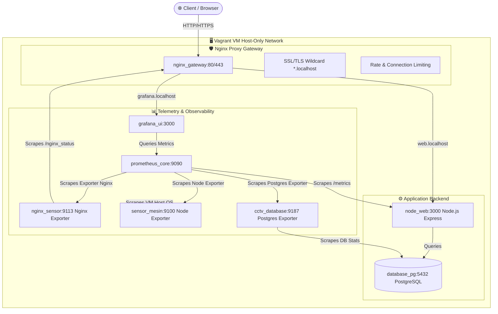
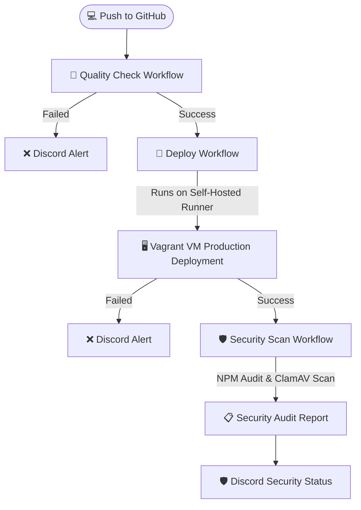

# 🚀 HexaObserve - Next-Gen Observation & Monitoring Suite

Platform monitoring, observabilitas (*observability*), dan gateway produksi yang tangguh, aman, dan *fully-automated* menggunakan standar industri terkini. Proyek ini dibangun sebagai demonstrasi komprehensif dari implementasi **DevOps, DevSecOps, SRE (Site Reliability Engineering), dan Full-Stack Web Development**.

---

## 🖥️ Arsitektur Sistem

Sistem ini didesain menggunakan topologi multi-tier containerized yang aman, di mana semua trafik masuk disaring oleh **Nginx Reverse Proxy Gateway** sebelum diarahkan ke layanan internal.



---

## 🛠️ Fitur Utama & Hardening Keamanan

### 1. Nginx Reverse Proxy & Proteksi DDoS
*   **SSL/TLS Termination**: Mengamankan koneksi klien dengan HTTPS menggunakan sertifikat *wildcard* (`*.localhost`) berbasis TLSv1.2 dan TLSv1.3.
*   **Pengalihan Otomatis**: Secara otomatis mengalihkan lalu lintas port `80` (HTTP) ke port `443` (HTTPS).
*   **Slowloris & Timeout Protection**: Mengurangi window time untuk header & body timeouts (`client_body_timeout 10s`, `client_header_timeout 10s`, `keepalive_timeout 65s`) untuk mencegah kehabisan slot koneksi (*connection exhaustion*).
*   **Smart Rate Limiting (Token Bucket)**:
    *   **Aplikasi Web (`web.localhost`)**: Dibatasi maksimal **15 request per detik** per IP, dengan toleransi lonjakan (`burst`) sebanyak 20 request dan penundaan (`delay=10`) untuk transisi trafik yang mulus.
    *   **Grafana Dashboard (`grafana.localhost`)**: Dibatasi maksimal **50 request per detik** per IP dengan toleransi lonjakan (`burst`) 100 request dan penundaan (`delay=50`) untuk mendukung pemuatan diagram yang intensif secara bersamaan.
*   **TCP Connection Limiting**:
    *   Membatasi maksimal **15 koneksi paralel** per IP ke aplikasi web.
    *   Membatasi maksimal **30 koneksi paralel** per IP ke Grafana dashboard.
*   **Custom Error Response**: Memberikan respons standar HTTP `503 Service Unavailable` bagi IP yang melebihi batas batas aman untuk menstabilkan beban server tanpa merusak akses bagi pengguna normal.

### 2. Autentikasi Pengguna & Sesi Persisten
*   **JWT Authentication**: Keamanan berbasis token dengan secret key terenkripsi.
*   **Redundant Auth Persistence**: Sesi login disimpan secara berlebih (*redundant*) menggunakan kombinasi Cookie yang aman serta `localStorage` caching pada klien, memastikan pengalaman pengguna yang stabil dan sinkronisasi status login yang presisi.
*   **Security Headers**: Menggunakan `Helmet.js` untuk menambahkan lapisan perlindungan XSS, Clickjacking, dan MIME sniffing pada Express.js.

### 3. Observabilitas Penuh (SRE & Telemetry Stack)
*   **Metrik Kustom Backend**: Aplikasi Node.js menggunakan pustaka `prom-client` untuk mengekspos telemetri performa backend (seperti durasi request HTTP, error rate, garbage collection, heap memory) secara *real-time* di endpoint `/metrics`.
*   **Exporter Nginx**: Melacak metrik traffic throughput Nginx, active connections, handshakes, request rate melalui `nginx-prometheus-exporter` (`nginx_sensor`) yang menyadap stub status `/nginx_status`.
*   **Database Metrics**: Melacak statistik PostgreSQL (koneksi aktif, query runtime, read/write I/O, cache hit-rate) menggunakan `postgres-exporter` (`cctv_database`).
*   **Host System Metrics**: Mengamati metrik utilisasi hardware CPU, Memory, Disk I/O, dan Network interface pada mesin virtual menggunakan `node-exporter` (`sensor_mesin`).
*   **Visualisasi Grafana**: Seluruh metrik dari Prometheus diagregasikan secara dinamis ke panel dashboard Grafana untuk analisis dan troubleshooting secara *real-time*.

---

## 🔄 Pipeline CI/CD & DevSecOps Automation

Proyek ini dilengkapi dengan pipeline automasi beruntun (*chained pipeline*) yang terintegrasi penuh ke Discord.



### 1. Kualitas Kode (Quality Check) - `quality-check.yml`
*   **Trigger**: Berjalan otomatis saat `push` atau `pull_request` ke branch `main`.
*   **Runner**: GitHub-hosted runner (`ubuntu-latest`).
*   **Aksi**: Menjalankan pemeriksaan linter (`npm run lint`) dan unit test bawaan Node.js (`npm test`).
*   **Hasil**: Mengirimkan notifikasi kelulusan kode atau rincian kegagalan langsung ke channel Discord menggunakan webhook khusus.

### 2. Otomasi Deploy Lokal - `deploy.yml`
*   **Trigger**: Berjalan setelah workflow *Quality Check* berhasil dengan status sukses (`workflow_run: completed & success`).
*   **Runner**: **Self-Hosted Runner** yang terinstal di dalam Vagrant VM lokal.
*   **Aksi**: Menarik kode terbaru, sinkronisasi file ke folder produksi `/home/vagrant/projectWeb1/` menggunakan `rsync` (aman dari penimpaan file sensitif seperti `.env` dan sertifikat SSL Nginx), lalu menjalankan `docker compose down` dan `docker compose up --build -d` untuk memuat ulang seluruh kontainer dalam mode produksi (`NODE_ENV=production`, clean dependencies install).
*   **Hasil**: Mengirimkan notifikasi status deployment sukses/gagal ke Discord lengkap dengan commit log terbaru.

### 3. Pemeriksaan Keamanan - `security-check.yml`
*   **Trigger**: Berjalan otomatis setiap kali deployment selesai, terjadwal berkala (setiap Minggu pukul 00:00 UTC), atau dipicu manual (`workflow_dispatch`).
*   **Runner**: GitHub-hosted runner.
*   **Aksi**:
    *   **Dependency Audit (`npm audit`)**: Memindai pustaka pihak ketiga dari kerentanan keamanan dengan ambang batas *High/Critical severity*.
    *   **Malware Scan (ClamAV)**: Memasang antivirus ClamAV di runner dan memindai source-code dari virus, malware, backdoor, atau Trojan.
*   **Hasil**: Mengevaluasi laporan audit, mengkategorikan status, dan mengirimkan ringkasan audit keamanan ke Discord tanpa menghentikan deployment aktif (*check-only mode*).

---

## 💻 Tech Stack yang Digunakan

| Komponen | Teknologi | Kategori / Peran |
| --- | --- | --- |
| **Frontend** | HTML5, Vanilla CSS (Modern design with glassmorphism, responsive grid) | Antarmuka pengguna dashboard HexaObserve yang premium dan interaktif. |
| **Backend** | Node.js, Express.js, JWT, Helmet.js | Logika web server, API autentikasi, penyedia metrik Prometheus (`prom-client`). |
| **Database** | PostgreSQL (v15-alpine) | Penyimpanan data pengguna secara persisten. |
| **Gateway & Security** | Nginx, SSL/TLS self-signed, Rate Limiting, Connection Limiting | Gateway reverse proxy, SSL termination, mitigasi DDoS & Slowloris. |
| **Monitoring Core** | Prometheus | Database deret waktu (*time-series*) pengumpul data telemetri. |
| **Dashboard** | Grafana | Visualisasi data telemetri dalam bentuk grafik dan panel dinamis. |
| **DevSecOps Agents** | ClamAV, `npm audit` | Pemindaian malware & audit celah keamanan dependensi secara berkala. |
| **CI/CD Platform** | GitHub Actions (Runner & Self-hosted runner) | Automasi integrasi, pengujian, peluncuran, dan audit keamanan. |
| **Notifikasi** | Discord Webhook | Saluran komunikasi real-time hasil CI/CD dan laporan audit DevSecOps. |

---

## 🚀 Panduan Memulai (Getting Started)

### 📋 Prasyarat
*   **Vagrant** terinstal pada sistem host Anda.
*   **VirtualBox** sebagai virtualisasi provider.
*   Koneksi internet aktif untuk download base box dan dependency.

### 🛠️ Langkah Demi Langkah

#### 1. Jalankan VM Vagrant
Buka terminal pada direktori root proyek ini pada sistem host Anda (lokasi `Vagrantfile`), lalu jalankan:
```bash
vagrant up
```
*Vagrant akan mengunduh box `ubuntu/jammy64`, mengalokasikan resource CPU (4 core) & RAM (4 GB), serta mengonfigurasi forward port (`80`, `443`, `3000`, `8080`, `9090`).*

#### 2. Konfigurasi Domain Lokal (File Hosts)
Agar domain virtual host dapat dikenali oleh browser di komputer host, tambahkan entri berikut pada file `hosts` sistem operasi Anda:

*   **Windows**: `C:\Windows\System32\drivers\etc\hosts`
*   **Linux / macOS**: `/etc/hosts`

```text
127.0.0.1  web.localhost
127.0.0.1  grafana.localhost
```

#### 3. Masuk ke VM dan Jalankan Layanan
Masuk ke VM via SSH:
```bash
vagrant ssh
```
Setelah masuk ke dalam shell VM, navigasikan ke folder project dan jalankan docker-compose:
```bash
cd /home/vagrant/projectWeb1
docker compose up -d
```
*Docker Compose akan memuat PostgreSQL, Node.js Web App, Nginx Exporter, Node Exporter, Postgres Exporter, Prometheus, Grafana, dan Nginx Gateway.*

#### 4. Akses Endpoint
Setelah semua container berjalan normal (`docker compose ps`), Anda dapat mengakses layanan dari browser di komputer host:

*   **Aplikasi Utama (HexaObserve)**: [https://web.localhost](https://web.localhost) *(Terima peringatan SSL self-signed di browser)*
*   **Dashboard Monitoring (Grafana)**: [https://grafana.localhost](https://grafana.localhost) *(Akun default: Username: `admin` \| Password: `admin`)*
*   **Database Health Check (API)**: `https://web.localhost/test-db`
*   **Prometheus Web UI**: `http://localhost:9090`

---

## 📈 Tampilan Visual Dashboard
*Berikut adalah representasi monitoring dashboard yang berhasil dikonfigurasikan:*

> [!NOTE]
> Metrik telemetri didistribusikan secara *real-time* dari aplikasi, gateway Nginx, database PostgreSQL, dan Host VM untuk menjamin observabilitas operasional penuh (SRE Best Practices).

---

## 📝 Lisensi
Proyek ini dibuat untuk kebutuhan portofolio DevOps & DevSecOps. Kode disediakan secara terbuka sebagai bentuk demonstrasi kapabilitas integrasi sistem produksi modern.
